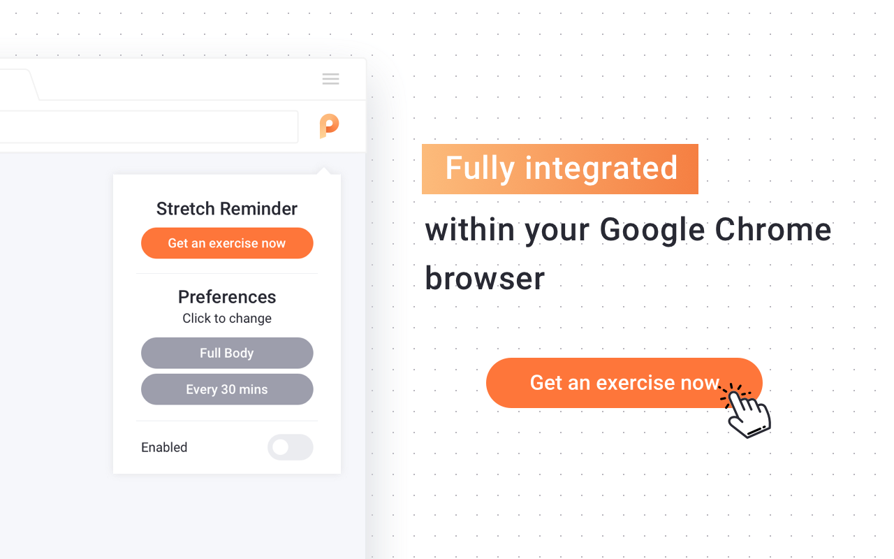

# Stretch Reminder

> **Note:** This project is no longer actively maintained and has been removed from the Chrome Web Store. It was originally published as a Chrome extension from 2016–2024 with 1000+ daily active users. The source code is preserved here for reference. You can still run it locally by loading it as an unpacked extension.

A Chrome extension that reminded users to stretch every 30, 60, or 120 minutes with office-friendly exercises. Built to help people take care of their bodies during long work sessions.

<p align="center">
  
</p>

## Features

- **Timed reminders** — stretch notifications every 30 minutes, 1 hour, or 2 hours
- **Targeted exercises** — upper body, lower body, or full body stretches
- **One-click toggle** — enable or disable reminders from the popup
- **Popup window** — exercises open in a dedicated window so they don't disrupt your tabs
- **Offline-ready** — all exercise data is bundled locally, no external API calls

## Screenshots

| Popup | Exercise Notification |
|-------|----------------------|
|  |  |

## Running Locally

If you'd like to try it out, you can load the extension from source:

1. Clone or download this repository
2. Open `chrome://extensions` in Chrome
3. Enable **Developer mode** (toggle in the top right)
4. Click **Load unpacked** and select the repository folder
5. The Stretch Reminder icon will appear in your toolbar

## Usage

Click the extension icon in your Chrome toolbar to open the popup, where you can:

- **Get an exercise now** — open a stretch exercise immediately
- **Change exercise type** — cycle through Upper Body, Lower Body, and Full Body
- **Change frequency** — cycle through Every 30 Minutes, Every 1 Hour, and Every 2 Hours
- **Enable / disable** — toggle the reminder on or off

When a reminder fires, a popup window opens with a random exercise, including the name, rep count, step-by-step instructions, and an illustration.

## Project Structure

```
├── manifest.json          # Extension manifest (Manifest V3)
├── popup.html             # Toolbar popup UI
├── notification.html      # Exercise notification page
├── js/
│   ├── background.js      # Service worker — alarm & notification logic
│   ├── popup.js           # Popup controls & settings
│   ├── notification.js    # Exercise selection & display
│   └── fontawesome.js     # Icon font
├── css/
│   ├── popup.css          # Popup styles
│   ├── notification.css   # Notification styles
│   └── bootstrap.min.css  # Bootstrap (notification layout)
├── exercises/             # Bundled exercise data (JSON)
├── logo/                  # Icons & screenshots
└── docs/                  # GitHub Pages site
```

## Version History

| Version | Highlights |
|---------|------------|
| 0.5.1 | Fixed alarm firing on Chrome restart; fixed alarm timing not respecting frequency setting; minor bug fixes |
| 0.5.0 | Migrated to Manifest V3, removed jQuery/Bootstrap JS, localized exercise data, optimized tab tracking |
| 0.4.0 | API bug fixes, added About link in popup |
| 0.3.0 | API bug fixes, re-published to Chrome Web Store |
| 0.2.x | Design overhaul |
| 0.1.0 | First published version — frequency selector, exercise types, bootstrap styling |

## Links

- [Project homepage](https://guanzgrace.github.io/stretch/)
- Exercise data sourced from [Physera](https://physera.com/)

## License

This project is open source. Exercise data and illustrations are property of Physera.
